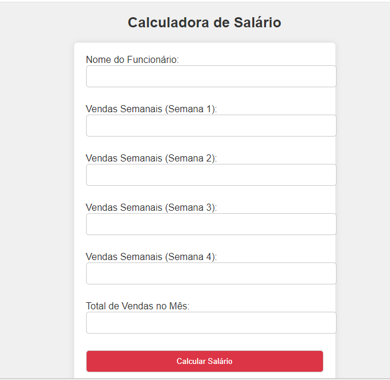

# Calculadora de Salário de Funcionário

Este é um código simples em PHP que calcula o salário final de um funcionário com base nas vendas semanais e totais.

## Instruções de Uso

1. Preencha o nome do funcionário e as vendas semanais nos campos fornecidos.
2. Clique no botão "Calcular Salário" para obter o resultado.

## Detalhes do Cálculo

- Salário Base: R$ 1856.94
- Meta Semanal: R$ 20,000
- Meta Mensal: R$ 80,000
- Bônus Semanal:
    - Se as vendas semanais atingirem ou ultrapassarem a meta semanal, o funcionário recebe um bônus de 5% sobre o valor excedente e 1% sobre a meta.
- Bônus Mensal:
    - Se as vendas totais no mês ultrapassarem a meta mensal, o funcionário recebe um bônus de 10% sobre o valor excedente.

## Resultado

O código exibirá o nome do funcionário e o salário final calculado com base nas vendas e nos bônus. O salário final será formatado em reais (R$) com duas casas decimais.

